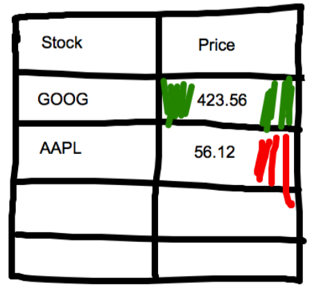

= Lab

[abstract]
You will implement an application that uses jQuery, AJAX, BootStrap and LocalStorage.

== Problem

* You have an array of stock symbols that you will get from the server. 

* Modify webserver.js with the following code appropriately and don't forget to restart it

[source,javascript]
----
if(url.match(/stocks/)){
	getStockSymbols(response);
}

function getStockSymbols(response){
	var output = {"symbols": ["MS", "GOOG", "INTC", "AAPL", "GM", "FB", "INFY", "HP"] };
	response.end(JSON.stringify(output));
}
----

* You will send AJAX requests to the following url by passing each and every symbol.

****
http://query.yahooapis.com/v1/public/yql?q=select%20*%20from%20yahoo.finance.quotes%20where%20symbol%20in%20(%22ACTUALSYMBOL%22)%0A%09%09&env=http%3A%2F%2Fdatatables.org%2Falltables.env&format=json
****
* Modify the word _ACTUALSYMBOL_ with the actual symbol.

* I suggest you run this URL with an actual symbol in the browser and study the output. You can use http://jsonlint.com to format the JSON output
 
* Once you get the output look for 
* 1)response.query.results.quote.LastTradePriceOnly 
* 2)response.query.results.quote.Change

* Display the symbols in a responsive table with "symbol" and "price" columns. If the price Change is positive display the cell in GREEN color and if the Change is negative display the cell in RED color.

* Here's a roughcut of how your page may look like 
*  +

* Every 20 seconds fetch the values again. (Search for window.setInterval)

[NOTE]
====
When you close the browser and open the page the stock symbols should be loaded from cache ie., local storage.
====